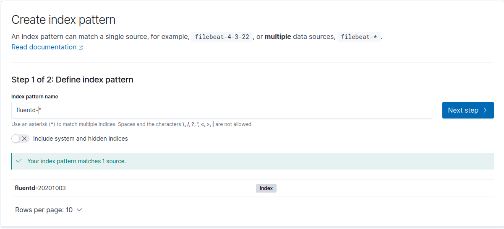
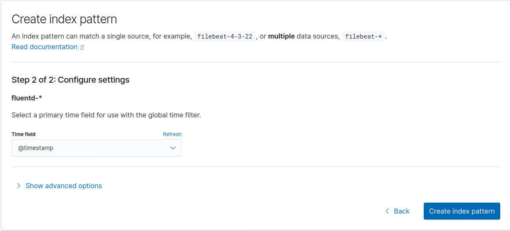

# fluentd-config

The purpose of this project is to test various iterations of docker/fluentd/conf/fluent.conf. Thne docker/fluentd/conf directory contains  some experimental config and a README that describes what each config does and how to use it.

docker-compose starts 4 hosts:

 - web (localhost:80)
 - fluentd (localhost:24224)
 - elasticsearch (localhost:9200)
 - kibana (localhost:5601)

**IMPORTANT NOTE:**

my host is ubuntu 2020.4 and the syslog timezone is not in the RFC3164 syslog format so fluentd uses the local timezone as the default. The local timezone is the docker container timezone, so it's important that I configure docker compose so the container timezone is the same as my host timezone or things get confusing


To play with it, start the containers:
```shell script
make start
```


Check the fluentd logs to make sure it connetcs to elasticsearch
```shell script
docker logs -f $(docker ps | grep fluentd-config_fluentd | awk '{print $1}')


2020-10-03 10:19:15 +0000 [info]: parsing config file is succeeded path="/fluentd/etc/fluent.conf"
2020-10-03 10:19:15 +0000 [info]: gem 'fluent-plugin-elasticsearch' version '4.2.0'
2020-10-03 10:19:15 +0000 [info]: gem 'fluentd' version '1.11.3'
2020-10-03 10:19:15 +0000 [info]: 'flush_interval' is configured at out side of <buffer>. 'flush_mode' is set to 'interval' to keep existing behaviour
2020-10-03 10:19:15 +0000 [warn]: define <match fluent.**> to capture fluentd logs in top level is deprecated. Use <label @FLUENT_LOG> instead
2020-10-03 10:19:15 +0000 [info]: using configuration file: <ROOT>
  <source>
    @type forward
    port 24224
    bind "0.0.0.0"
  </source>
  <match *.**>
    @type copy
    <store>
      @type "elasticsearch"
      host "elasticsearch"
      port 9200
      logstash_format true
      logstash_prefix "fluentd"
      logstash_dateformat "%Y%m%d"
      include_tag_key true
      type_name "access_log"
      tag_key "@log_name"
      flush_interval 1s
      <buffer>
        flush_interval 1s
      </buffer>
    </store>
    <store>
      @type "stdout"
    </store>
  </match>
</ROOT>
2020-10-03 10:19:15 +0000 [info]: starting fluentd-1.11.3 pid=6 ruby="2.6.6"
2020-10-03 10:19:15 +0000 [info]: spawn command to main:  cmdline=["/usr/local/bin/ruby", "-Eascii-8bit:ascii-8bit", "/usr/local/bundle/bin/fluentd", "-c", "/fluentd/etc/fluent.conf", "-p", "/fluentd/plugins", "--under-supervisor"]
2020-10-03 10:19:15 +0000 [info]: adding match pattern="*.**" type="copy"
2020-10-03 10:19:16 +0000 [info]: #0 'flush_interval' is configured at out side of <buffer>. 'flush_mode' is set to 'interval' to keep existing behaviour
2020-10-03 10:19:18 +0000 [warn]: #0 Could not communicate to Elasticsearch, resetting connection and trying again. Connection refused - connect(2) for 172.22.0.2:9200 (Errno::ECONNREFUSED)
2020-10-03 10:19:18 +0000 [warn]: #0 Remaining retry: 14. Retry to communicate after 2 second(s).
2020-10-03 10:19:22 +0000 [warn]: #0 Could not communicate to Elasticsearch, resetting connection and trying again. Connection refused - connect(2) for 172.22.0.2:9200 (Errno::ECONNREFUSED)
2020-10-03 10:19:22 +0000 [warn]: #0 Remaining retry: 13. Retry to communicate after 4 second(s).
2020-10-03 10:19:30 +0000 [warn]: #0 Could not communicate to Elasticsearch, resetting connection and trying again. Connection refused - connect(2) for 172.22.0.2:9200 (Errno::ECONNREFUSED)
2020-10-03 10:19:30 +0000 [warn]: #0 Remaining retry: 12. Retry to communicate after 8 second(s).
2020-10-03 10:19:30 +0000 [warn]: #0 Detected ES 7.x: `_doc` will be used as the document `_type`.
2020-10-03 10:19:30 +0000 [info]: adding source type="forward"
2020-10-03 10:19:30 +0000 [warn]: #0 define <match fluent.**> to capture fluentd logs in top level is deprecated. Use <label @FLUENT_LOG> instead
2020-10-03 10:19:30 +0000 [info]: #0 starting fluentd worker pid=15 ppid=6 worker=0
2020-10-03 10:19:30 +0000 [info]: #0 listening port port=24224 bind="0.0.0.0"
2020-10-03 10:19:30 +0000 [info]: #0 fluentd worker is now running worker=0
2020-10-03 10:19:30.079296450 +0000 fluent.info: {"pid":15,"ppid":6,"worker":0,"message":"starting fluentd worker pid=15 ppid=6 worker=0"}
2020-10-03 10:19:30.080124465 +0000 fluent.info: {"port":24224,"bind":"0.0.0.0","message":"listening port port=24224 bind=\"0.0.0.0\""}
2020-10-03 10:19:30.080804945 +0000 fluent.info: {"worker":0,"message":"fluentd worker is now running worker=0"}
warning: 299 Elasticsearch-7.9.1-083627f112ba94dffc1232e8b42b73492789ef91 "[types removal] Specifying types in bulk requests is deprecated."

```

browse to the web server  (http://localhost) and hit refresh a few times to generate some data

browse to kibana and setup an index (fluentd-*) :



using @timestamp for time:




Now  go back to the kibana discover page to see the event data.  Yu can generate more events by refreshing:
http://localhost:80

to check logs no the fluent container:
```shell script
docker logs -f $(docker ps | grep fluentd-config_fluentd | awk '{print $1}')
```

To get a shell in the fluent container
```shell script
docker exec -it  $(docker ps | grep fluentd-config_fluentd | awk '{print $1}') /bin/bash
```


To test a new fluents config and watch the logs, just edit the file docker/fluentd/conf/fluent.conf then  run:
```shell script
docker-compose restart fluentd && docker logs -f $(docker ps | grep fluentd-config_fluentd | awk '{print $1}'
```


## Managing Elasticsearch data


list the indices in this example:

https://www.elastic.co/guide/en/elasticsearch/reference/current/cat-indices.html

```shell script
curl -X GET "localhost:9200/_cat/indices/fluentd-*?v&s=index&pretty"
health status index            uuid                   pri rep docs.count docs.deleted store.size pri.store.size
yellow open   fluentd-20201003 RCcSzRvgSLWVi_46cE4zkw   1   1        406            0    112.6kb        112.6kb
yellow open   fluentd-20201004 k5oUyzKfQsy5CnnZ2Livfw   1   1        282            0      151kb          151kb

```

drop an index:

https://www.elastic.co/guide/en/elasticsearch/reference/current/indices-delete-index.html

```shell script
curl -X DELETE "localhost:9200/fluentd-20201003?pretty"

```